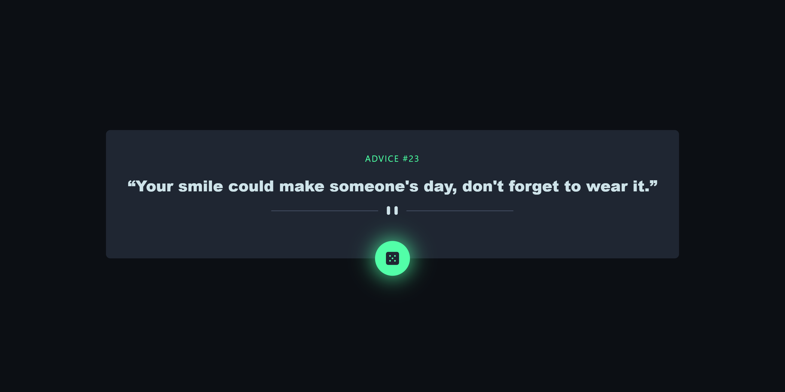

# Frontend Mentor - Advice generator app solution

This is a solution to the [Advice generator app challenge on Frontend Mentor](https://www.frontendmentor.io/challenges/advice-generator-app-QdUG-13db). Frontend Mentor challenges help you improve your coding skills by building realistic projects.

## Table of contents

- [Overview](#overview)
  - [The challenge](#the-challenge)
  - [Screenshot](#screenshot)
  - [Links](#links)
- [My process](#my-process)
  - [Built with](#built-with)
  - [What I learned](#what-i-learned)
  - [Continued development](#continued-development)
  - [Useful resources](#useful-resources)
- [Author](#author)

## Overview

### The challenge

Users should be able to:

- View the optimal layout for the app depending on their device's screen size
- See hover states for all interactive elements on the page
- Generate a new piece of advice by clicking the dice icon

### Screenshot



### Links

- Solution URL: [](https://github.com/mzs21/advice-app-generator)
- Live Site URL: [](https://mzs21.github.io/advice-app-generator/)

## My process

### Built with

- [ViteJS](https://vitejs.dev/) - Development tool
- Mobile-first workflow
- [TypeScript](https://www.typescriptlang.org/) - Programming language
- [React](https://reactjs.org/) - JS library
- [Tailwind CSS](https://tailwindcss.com/) - CSS framework
- [React Query](https://react-query-v3.tanstack.com/) - For fetching data
- [Axios](https://axios-http.com/) - For making API requests

### What I learned

Basic of [React Query](https://react-query-v3.tanstack.com/) - For fetching data

```tsx
const client = new QueryClient();
// The value which we will pass through QueryClientProvider is created with QueryClient.
```

```tsx
<QueryClientProvider client={client}>
  {/*  QueryClientProvider acts like React.ContextProvider. The value we pass in ContextAPI is called "client" here. */}
  .....
</QueryClientProvider>
```

```tsx
const AdviceBox = () => {
  const { data, refetch, isError, isLoading, error } = useQuery("advice", () =>
    getAdvice()
  );

  // On the left side, the parameters are -
  // - "data" where fetched data will be stored
  // - "refetch" will work when retriving data by clicking,
  // - "isError" checks if there is an error,
  // - "isLoading" is basically the data is loading,
  // - "error" is the error

  // On the right side, The first parameter in useQuery is for caching, second parameter is a fetch function.
```

### Continued development

- [ViteJS](https://vitejs.dev/) - Development tool
- Mobile-first workflow
- [TypeScript](https://www.typescriptlang.org/) - Programming language
- [React](https://reactjs.org/) - JS library
- [Tailwind CSS](https://tailwindcss.com/) - CSS framework
- [React Query](https://react-query-v3.tanstack.com/) - For fetching data
- [Axios](https://axios-http.com/) - For making API requests

### Useful resources

- [4 ways to fetch fetch data from API in React (Bangla) | fetch axios swr and react-query](https://youtu.be/7exOfIAKuWU) - This helped me for bird eye view on [React Query](https://react-query-v3.tanstack.com/)

- [React Query Tutorial for Beginners - Codevolution](https://youtube.com/playlist?list=PLC3y8-rFHvwjTELCrPrcZlo6blLBUspd2)

## Author

- Website - [MD MASHROOR ZILAN SNIGDHO](https://www.linkedin.com/in/mdmzs/)
- Frontend Mentor - [@mzs21](https://www.frontendmentor.io/profile/mzs21)
- Twitter - [@Snigdho21](https://twitter.com/Snigdho21)
